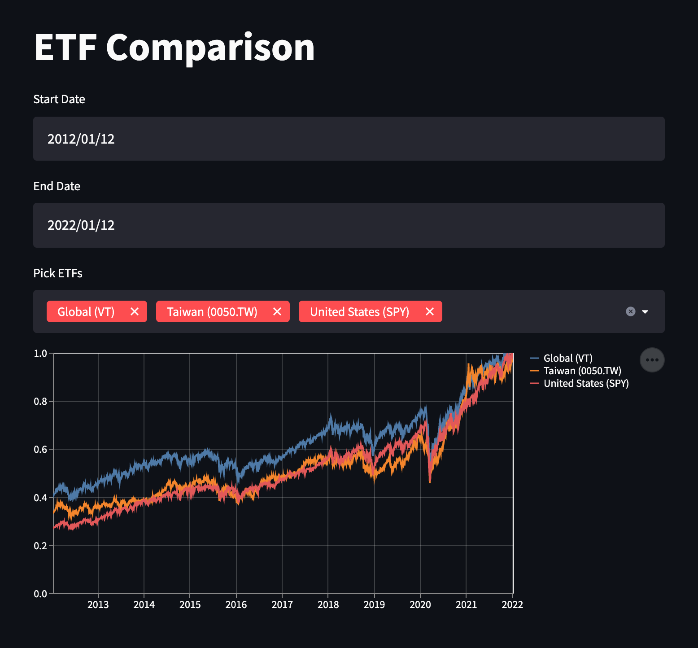

# ETF Comparison
It is a simple ETF comparison app which compares [VT][vt], [SPY][spy], and [0050.TW][0050.tw] ETFs and helps you figure out which one could generate greater returns in a specific time period. Check this out on the [demo page][demo].

## Instructions
1. Install dependencies with `pip install -r requirements.txt`.
2. Start the app with `streamlit run etf-comparison.py`.
3. Go to the `http://localhost:8501` URL on your browser to use the app.

## License
Streamlit is completely free and open-source and licensed under the [MIT][license] license.

[license]: LICENSE
[demo]: https://share.streamlit.io/evanxd/etf-comparison/main/etf-comparison.py
[vt]: https://finance.yahoo.com/quote/vt/
[spy]: https://finance.yahoo.com/quote/spy/
[0050.tw]: https://finance.yahoo.com/quote/0050.TW/
